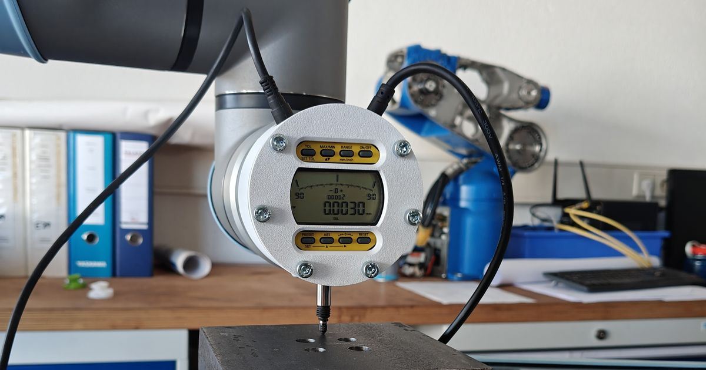
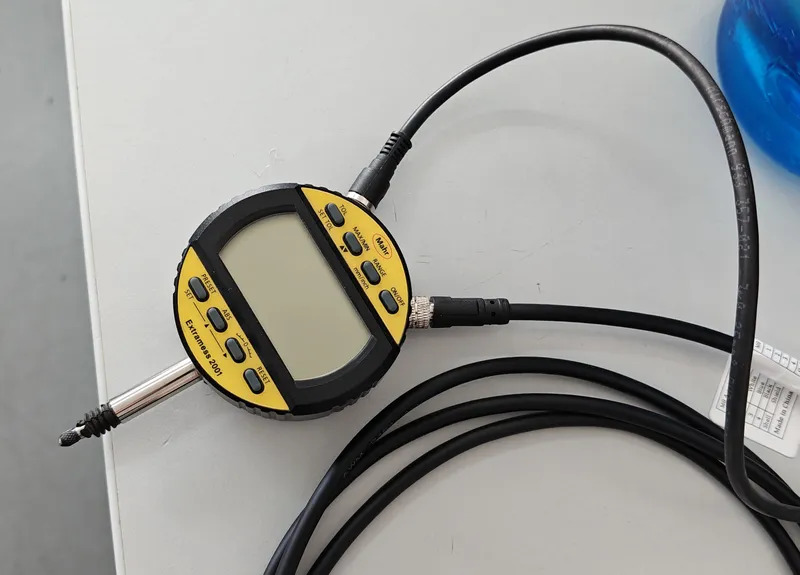
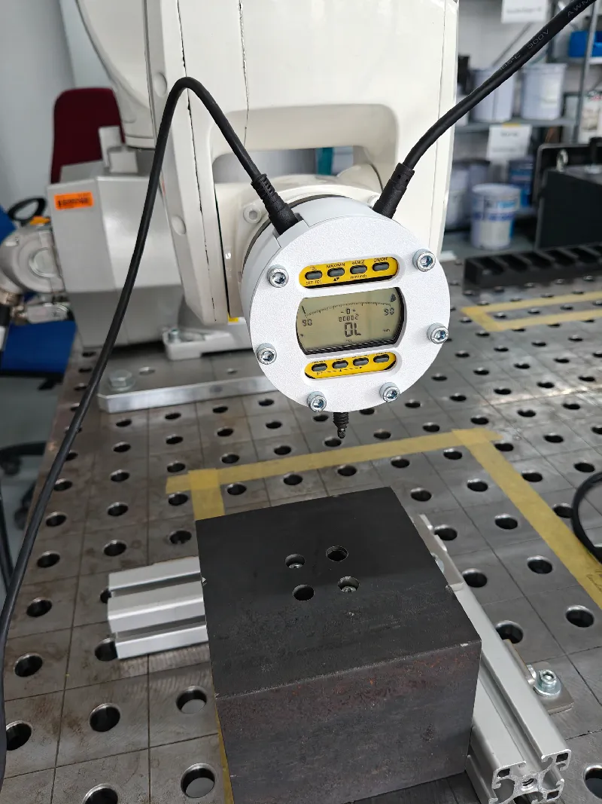
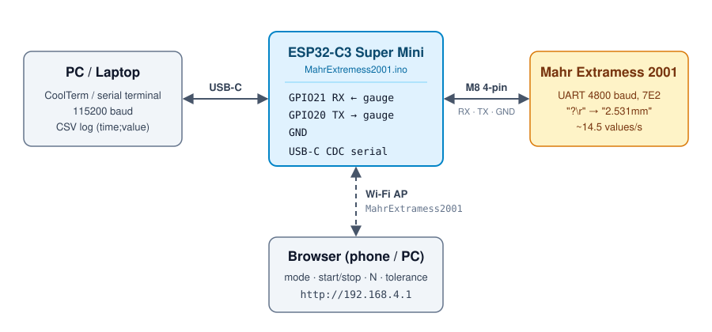

# Mahr Extramess 2001 – ESP32-C3 Interface

A low-cost ESP32-C3 interface for the **Mahr Extramess 2001** dial gauge. It replaces the €111 original cable and pushes the data rate from the **1 Hz** of the official software to **~14.5 Hz**, with timestamped CSV output over USB and two measurement modes for robot/axis testing.

<p align="center">
  
</p>

| | |
|---|---|
| **Cable add-on (Printables)** | [ESP32-C3 Super Mini Cable AddOn](https://www.printables.com/model/1326128-esp32-c3-super-mini-cabel-addon) |
| **Gauge housing (Printables)** | [Mahr Extremess 2001 Tool](https://www.printables.com/model/1326148-mahr-extremess-2001-tool) |
| **Firmware** | `MahrExtremess2001.ino` + `html.h` (this repo) |

---

## Why?

- The original Mahr cable costs **€111** – mostly because of an integrated FTDI USB-serial chip.
- The official software only reads **1 value per second**, which is far too slow to see how a robot or axis actually moves into position.
- The serial protocol was sniffed between MahrConnect and the gauge, so an ESP32-C3 can talk to it directly.

---

## Hardware

| Part | Notes |
|---|---|
| Mahr Extramess 2001 | Digital dial gauge with UART interface |
| [ESP32-C3 Super Mini](https://de.aliexpress.com/item/1005005967641936.html) | UART to the gauge, USB-CDC to the PC, Wi-Fi for the web UI |
| [M8 4-pin cable](https://www.amazon.de/dp/B0CNXGKMMK) | Connects the ESP32 to the gauge |
| [Cable AddOn case](https://www.printables.com/model/1326128-esp32-c3-super-mini-cabel-addon) | Slim ESP32-C3 case with cable strain relief and Mahr Extramess 2001 label (remix of *Slim case for ESP32-C3 Super Mini* by scross01) |
| [Gauge housing](https://www.printables.com/model/1326148-mahr-extremess-2001-tool) *(optional)* | Rigid housing for mounting the gauge on a robot (e.g. KUKA KR6) or a fixture. Press fit, secured with **6× M5 screws**, buttons and display stay accessible, two slots for the power and data cable. Multicolor and single-color versions available. |

<p align="center">
  
  &nbsp;
  
</p>
<p align="center"><sub>Left: ESP32-C3 cable add-on · Right: gauge housing</sub></p>

### Wiring

<p align="center">
  
</p>

| ESP32-C3 | Function |
|---|---|
| GPIO21 | RX (from gauge) |
| GPIO20 | TX (to gauge) |
| GND | GND |

<!-- Add the M8 pin assignment (pin number / wire color → signal) here -->

---

## Serial Protocol

| Setting | Value |
|---|---|
| Baud rate | 4800 |
| Data bits | 7 |
| Parity | Even |
| Stop bits | 2 |

```cpp
mySerial.begin(4800, SERIAL_7E2, 21, 20); // RX = GPIO21, TX = GPIO20
```

All commands are ASCII and terminated with a carriage return (`\r`). Replies end with `\r` as well; a measurement looks like `2.531mm`. When the gauge has no valid value it answers `ERR0`.

| Command | Function |
|---|---|
| `?\r` | Request current measurement |
| `RES1\r` / `RES2\r` / `RES3\r` | Select resolution/range preset 1 / 2 / 3 |
| `TOL?\r` | Query tolerance settings |
| `SET?\r` | Query device status |
| `RST\r` | Reset (also disables ABS) |
| `ABS\r` | Enable absolute mode |
| `BAT?\r` | Query battery status |
| `MAX\r` / `MIN\r` | Show max / min value on the display |
| `OFF\r` | Power off |

---

## Measurement Modes

Select the mode and start/stop the measurement in the web interface. The results are printed on the USB serial port (115200 baud).

### Repeatability (Wiederholgenauigkeit)

For repeatedly moving a robot/axis to the same point:

1. The gauge is polled continuously and the last *N* values are kept in a ring buffer.
2. As soon as all *N* values lie within the tolerance band, the position counts as **settled** and **one** value is logged.
3. The next value is only logged after the gauge has reported `ERR0` in between – i.e. the next approach.

| Parameter | Default | Range |
|---|---|---|
| Number of values *N* | 40 | 1–100 |
| Tolerance | 0.001 mm (web UI field shows 0.005) | – |

### Overshoot (Überschwingverhalten)

Logs **every** value with a timestamp, so the full motion – approach, overshoot, settling – can be plotted afterwards. If the gauge reports `ERR0` after valid data, a `.` is printed as a marker.

### Output format

Example:

```
time_s;value_mm
0,000;2,531
0,069;2,533
```

Time is relative to the first logged value. Semicolon separator and decimal comma, so the log opens directly in a German Excel. Record it with **CoolTerm** (or any serial terminal) as `.txt`/`.csv`.

---

## Web Interface

On boot the ESP32 opens its own Wi-Fi access point:

| | |
|---|---|
| SSID | `MahrExtramess2001` |
| Password | `12345678` |

Connect and open the IP printed on the serial monitor (by default `192.168.4.1`). The page offers mode selection, the repeatability parameters, start/stop and an overview of all gauge commands.

> **Work in progress:** the live chart and the macro buttons are already in the page layout but not yet connected to the firmware.

---

## Getting Started

1. Install the **ESP32 board package** in the Arduino IDE and select *ESP32C3 Dev Module* (enable *USB CDC On Boot*).
2. Install the [**ESPForm**](https://github.com/mobizt/ESPForm) library.
3. Open `MahrExtremess2001.ino` (with `html.h` in the same folder) and upload.
4. Connect the ESP32 to the gauge via the M8 cable and plug it into the PC.
5. Open CoolTerm at 115200 baud, start logging, connect to the `MahrExtramess2001` Wi-Fi and start a measurement.

Change the AP name/password in `MahrExtremess2001.ino` (`apSSID`, `apPSW`) if several units are used.

---

## Performance

- **Effective data rate:** ~14.5 Hz (official software: 1 Hz)
- **Limit:** 4800 baud with 7E2 framing plus the request/response cycle
- **Button lock-up:** polling faster than ~10 ms can make the gauge's front buttons unresponsive. In the current firmware the poll loop runs back-to-back (the `delay(5)` in `ueberschwingverhalten()` is commented out) – re-enable it if the buttons stop reacting.

---

## To Do

- [ ] Connect live chart and macro buttons in the web UI
- [ ] Stream measurements to the browser / download as CSV
- [ ] Optional Python live plot

---

## License

[GPL-3.0](LICENSE)

The 3D models are published on Printables under their own license terms.

---

## Contributing

Ideas and pull requests are welcome – especially for the web UI, live plotting and support for other Mahr devices.
